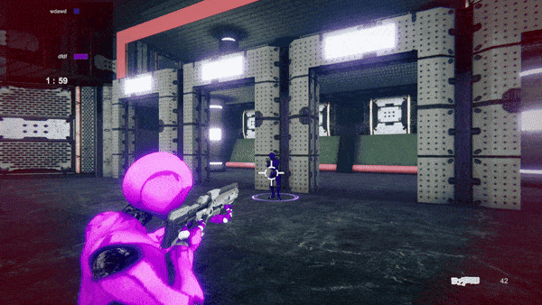

# MultiPlayer Cyber-Battle


**NOTE: This game was refactored and not re-done from scratch, even though a good arquitecture would require it, to face the fact that when working with a team, refactoring has to be done on top of what collegues have built.**

## Description

*MultiPlayer Cyber-Battle* is an exciting TPS game using Unity's Photon Network. Done following a tutorial. The game has only one level, but it includes three different gameplays:

- **Kill Count:** See who can kill more players in a time limit.
- **No Respawn:** See who is the last man standing.
- **Team Battle:** Two teams fight each other to see who can kill more players of the opposing team in a time limit.


## Key Features

- **Refactored Codebase:** Improved code organization and performance, ensuring a smoother and more maintainable experience.
- **Dynamic Damage Feedback:** Added a blood splatter effect on the screen whenever the player takes damage, providing immediate visual feedback. As the player’s health decreases, the screen margins gradually turn red, intensifying the sense of danger and urgency as they near critical health levels.


## Gameplay

### GIF 1: Dynamic damage feedback in action




## Example of Refactoring in Player Manager

To illustrate a feature of refactoring in this game, consider the following C# code that keeps track of the player state:

```csharp
public class PlayerManager : MonoBehaviourPunCallbacks{
	private void SetPlayerDeadState(bool isDead){
		gameObject.GetComponent<WeaponManager>().isDead = isDead;
		gameObject.GetComponentInChildren<AimLookAtRef>().isDead = isDead;
		gameObject.layer = (isDead)?LayerMask.NameToLayer("Ignore Raycast") : LayerMask.NameToLayer("Default");
	}
}
```

## Example of Unity Event usage in SpawnManager

To illustrate a feature of our game, consider the following C# code:

```csharp
public class SpawnManager : MonoBehaviour{
    private void OnEnable(){
        WeaponManager.OnNoWeaponsFound += SpawnWeaponStart;
    }
    private void OnDisable(){
        WeaponManager.OnNoWeaponsFound -= SpawnWeaponStart;
    }

private void SpawnWeaponStart()
    {
        for (int i = 0; i < weapons.Length; i++)
        {
            PhotonNetwork.Instantiate(weapons[i].name, weaponSpawnPoints[i].position, weaponSpawnPoints[i].rotation);
        }
    }
}
```

## Installation

1. Clone the repository: 
    ```bash
    git clone https://github.com/Rohadgal/MultiplayerCyberBattle
    ```
2. Open the project in Unity (I used the 2022.3.25f1 version).
3. Build and run the game.

## How to Play

1. Use WASD to move, mouse to turn and shoot.
2. Use Q key to change weapon and T key to see kill count menu in Kill Count and Team Battle mode.

## Contributing

I welcome contributions! 

## License

This project is licensed under the Open Source License - see the [LICENSE.md](LICENSE.md) file for details.

## Contact

For any inquiries or feedback, please contact [Your Name] at [your.email@example.com].
